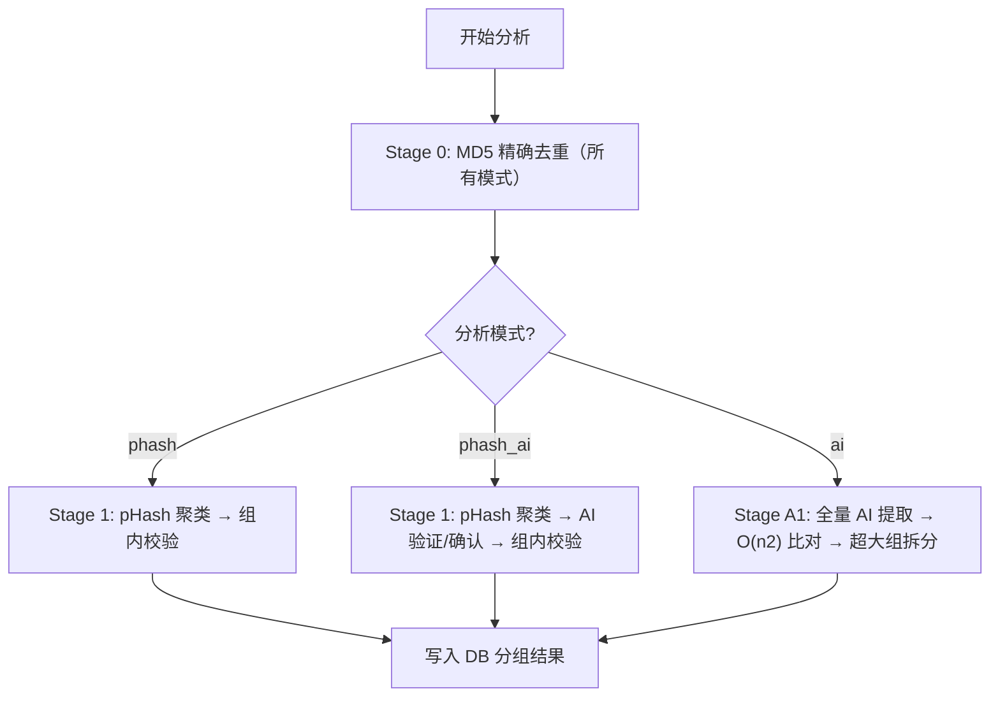

# 相似图片分析逻辑

> 本文档描述 SnapSift 相似图片去重的完整分析流程。  
> **对逻辑有任何改动都需同步更新此文档。**

---

## 三种分析模式

用户可在前端通过下拉菜单选择分析模式：

| 模式 | 名称 | 说明 | 适用场景 |
|---|---|---|---|
| `phash` | pHash Only | 仅使用感知哈希，速度最快 | 快速粗筛，图片量大时 |
| `phash_ai` | pHash + AI | pHash 预筛 + AI 验证确认（默认） | 平衡速度与准确度 |
| `ai` | Pure AI | 所有图片全量 AI 比对，不依赖 pHash | 追求最高召回率，不怕 pHash 漏检 |



---

## 聚类策略：Complete-Linkage

采用 **Complete-Linkage（完全链接）** 聚类策略。

核心规则：**候选对 (A, B) 要合并时，A 所在组的每一个成员必须与 B 所在组的每一个成员都满足相似阈值。** 任何一对不满足，则拒绝合并。

```
Single-Linkage (旧):
  A~B, B~C → A,B,C 同组（即使 A 和 C 完全不同）

Complete-Linkage (新):
  A~B, B~C, 但 A≁C → A,B 一组, C 独立
  ↑ 要求组内所有成员两两相似，杜绝链式扩散
```

实现位于 `dedup.rs` 的 `Clusters` 结构体，核心方法 `try_merge(a, b, is_similar)` 接受一个闭包判定任意两个成员是否相似。

---

## 模式一：pHash Only (`phash`)

### 流程

1. **Stage 0: MD5 精确去重** — 相同 MD5 强制合并
2. **Stage 1: pHash 比较** — O(n²) Hamming 距离，≤ 阈值的对用 Complete-Linkage 合并
3. **Stage 3: 组内校验** — pHash 一致性检查 + 超大组拆分

不涉及 AI，速度最快。

---

## 模式二：pHash + AI (`phash_ai`，默认)

### 流程

1. **Stage 0: MD5 精确去重**
2. **Stage 1: pHash 比较** — 距离 ≤ `phash_threshold` 加入确定对，9~`phash_suspect_max` 加入疑似对
3. **Stage 2a: AI 特征提取** — 仅提取组成员 + 疑似对参与者的向量（非全量）
4. **Stage 2b: AI 验证分组** — 踢出组内 cosine similarity 低于阈值的成员
5. **Stage 2c: AI 确认疑似对** — 对疑似对计算 cosine similarity，满足则合并
6. **Stage 3: 组内校验** — pHash 一致性检查 + 超大组拆分

平衡速度与准确度，AI 只处理 pHash 筛出的候选。

---

## 模式三：Pure AI (`ai`)

### 流程

1. **Stage 0: MD5 精确去重**
2. **Stage A1: 全量 AI 特征提取** — 为 **所有** 图片提取 MobileNet-v3 特征向量（多核并行）
3. **Stage A2: 全量 AI 比对** — O(n²) cosine similarity 比较，sim ≥ 阈值的对按相似度降序用 Complete-Linkage 合并
4. **Stage A3: 超大组拆分** — 超过 20 张的组用更严格的 cosine 阈值重新聚类

### 为什么需要 Pure AI 模式

pHash 是像素级感知哈希，对以下情况可能失效（Hamming 距离 > 12，完全漏检）：

- 不同曝光/白平衡的同一场景
- 轻微裁剪或不同宽高比
- HDR 合成前后
- 不同压缩质量的同一张照片
- 手机连拍中构图微调

在这些情况下，AI 向量（基于语义特征）仍能判断相似，但 pHash+AI 模式下 AI 根本没机会比较它们。Pure AI 模式通过全量比对解决这个问题。

### 性能说明

- 向量提取：~0.05s/张（rayon 多核并行），1000 张 ≈ 50s
- O(n²) cosine 比对：1000 张 = 50 万次 dot product ≈ < 1s
- 主要耗时在向量提取，比对本身很快
- 向量会缓存到 SQLite，下次分析同一批图片时直接读取

---

## 各阶段详细说明

### 预处理：路径去重

- 对所有文件路径做 `\` → `/` 规范化 + 小写化
- 用 `HashSet` 过滤重复路径，防止同一物理文件出现多次

### Stage 0: MD5 精确去重

- 相同 MD5 = 完全相同的文件（字节级一致）
- 直接强制合并到同一组，不走 Complete-Linkage 检查
- 时间复杂度 O(n)，使用 HashMap 聚合
- **所有模式都执行此阶段**

### Stage 1: pHash 感知哈希比较（phash / phash_ai 模式）

- O(n²) 遍历所有图片对，计算 64-bit pHash 的 Hamming 距离
- 距离 ≤ `phash_threshold` 的对加入"确定相似"列表
- 距离在 `phash_threshold+1` ~ `phash_suspect_max` 之间的对加入"疑似"列表（仅 phash_ai 模式）
- 确定相似对按距离从小到大排序后，逐对尝试 Complete-Linkage 合并

### Stage 2a: AI 特征提取（phash_ai 模式）

- 使用 MobileNet-v3-small ONNX 模型提取 feature vector
- **仅提取需要的文件**：Stage 1 已有组的成员 + 疑似对的参与者
- 向量缓存在 SQLite，多核并行提取（rayon）

### Stage 2b: AI 验证已有组（phash_ai 模式）

- 计算每个成员与组内其他所有成员的 cosine similarity
- 最低值 < `cosine_threshold` → 踢出

### Stage 2c: AI 确认疑似对（phash_ai 模式）

- 对疑似对计算 cosine similarity
- sim ≥ `cosine_threshold` 且 pHash 距离 ≤ `phash_suspect_max` → Complete-Linkage 合并

### Stage A1: 全量 AI 特征提取（ai 模式）

- 为 **所有** n 张图片提取特征向量
- 同样使用缓存 + rayon 多核并行

### Stage A2: 全量 AI 比对（ai 模式）

- O(n²) 遍历所有图片对，计算 cosine similarity
- sim ≥ `cosine_threshold` 的对按相似度**降序**排序
- 逐对尝试 Complete-Linkage 合并（仅基于 cosine，不看 pHash）

### Stage 3: 组内校验（phash / phash_ai 模式）

- 3a: 踢出 pHash 最大距离超标的成员
- 3b: 超大组（>20）用 `phash_threshold/2` 重新聚类

### Stage A3: 超大组拆分（ai 模式）

- 超大组（>20）用更严格的 cosine 阈值重新聚类
- 严格阈值 = `cosine_threshold + (1.0 - cosine_threshold) * 0.5`

---

## 关键参数

### 用户可调参数（前端 UI）

| 参数 | 默认值 | 范围 | 适用模式 | 说明 |
|---|---|---|---|---|
| **分析模式** | phash_ai | phash / phash_ai / ai | — | 下拉选择 |
| **pHash 阈值** | 8 | 2~16 | phash, phash_ai | Hamming 距离阈值，越小越严格 |
| **AI 相似度** | 93% | 80%~99% | phash_ai, ai | cosine similarity 阈值，越大越严格 |

UI 条件显示：
- `ai` 模式：隐藏 pHash 滑动条
- `phash` 模式：隐藏 AI 滑动条
- `phash_ai` 模式：两个滑动条都显示

### 自动派生参数

| 参数 | 计算方式 | 说明 |
|---|---|---|
| `phash_suspect_max` | `phash_threshold + 4` | pHash 疑似区间上限 |
| `max_ingroup_phash` | `phash_threshold + 4` | 组内一致性检查最大距离 |
| 超大组拆分阈值（pHash 模式） | `phash_threshold / 2` | 拆分时使用的更严格 pHash 阈值 |
| 超大组拆分阈值（AI 模式） | `cosine + (1-cosine)*0.5` | 拆分时使用的更严格 cosine 阈值 |

### 固定常量

| 参数 | 值 | 说明 |
|---|---|---|
| `MAX_GROUP_SIZE` | 20 | 超过此大小的组触发拆分 |

---

## 涉及文件

| 文件 | 职责 |
|---|---|
| `src-tauri/src/dedup.rs` | 核心去重算法：三种模式分支、Clusters 结构、Complete-Linkage、各阶段逻辑 |
| `src-tauri/src/embedder.rs` | AI 特征提取：MobileNet-v3 推理（tract/ort）、向量运算 |
| `src-tauri/src/scanner.rs` | 文件扫描：pHash 计算、MD5 计算、EXIF 提取 |
| `src-tauri/src/db.rs` | 数据库：向量缓存、分组存储、批量查询 |
| `src-tauri/src/models.rs` | 数据结构：DedupResult、DedupProgress、StageTiming 等 |
| `src-tauri/src/commands.rs` | Tauri 命令层：接收前端 mode/阈值参数并传递给 dedup 模块 |
| `src/lib/commands.ts` | 前端命令封装：传递 mode、phashThreshold、cosineThreshold |
| `src/pages/DuplicateReview.tsx` | 前端页面：模式选择器、阈值滑动条 UI、分析触发、结果展示 |

---

## 历史变更记录

| 日期 | 变更内容 |
|---|---|
| 2026-03-19 | **重大重构**：Union-Find → Complete-Linkage 聚类；删除 Stage 1.5 组间合并；收紧 PHASH 8/COSINE 0.93；AI 改为验证+确认角色；增加组内校验和超大组拆分 |
| 2026-03-19 | **用户可调阈值**：pHash 阈值和 AI 相似度从常量改为前端滑动条可调参数；后端通过 `DedupConfig` 统一管理；疑似区间和组内校验阈值自动派生 |
| 2026-03-19 | **三模式架构**：新增 Pure AI 模式（全量向量提取 + O(n²) cosine 比对）；新增 pHash Only 模式；前端添加模式选择器，根据模式条件显示/隐藏相关滑动条 |

---

## 已知局限与后续优化方向

1. **pHash 不具备旋转不变性**：旋转角度较大的相似图片依赖 AI 确认或 Pure AI 模式
2. **MobileNet-v3-small 分类层输出非最优嵌入**：后续可替换为 headless 模型或 CLIP 嵌入
3. **O(n²) 比较瓶颈**：图片量超过万张后可引入 LSH / FAISS 近似最近邻加速（Pure AI 模式尤其需要）
4. **视频去重**：当前仅支持图片，视频需关键帧提取后复用图片流程
5. **Complete-Linkage 的贪心特性**：合并顺序可能影响最终分组，排序缓解但未完全消除
