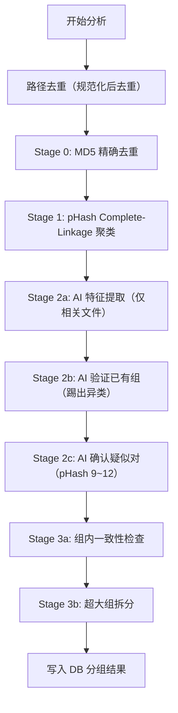

# 相似图片分析逻辑

> 本文档描述 SnapSift 相似图片去重的完整分析流程。  
> **对逻辑有任何改动都需同步更新此文档。**

---

## 整体流程



---

## 聚类策略：Complete-Linkage

采用 **Complete-Linkage（完全链接）** 聚类策略。

核心规则：**候选对 (A, B) 要合并时，A 所在组的每一个成员必须与 B 所在组的每一个成员都满足相似阈值。** 任何一对不满足，则拒绝合并。

这彻底避免了旧版 Union-Find (Single-Linkage) 的"传递链"问题：

```
Single-Linkage (旧):
  A~B, B~C → A,B,C 同组（即使 A 和 C 完全不同）
  ↑ 这就是 90 个文件夹被错误合并的根本原因

Complete-Linkage (新):
  A~B, B~C, 但 A≁C → A,B 一组, C 独立
  ↑ 要求组内所有成员两两相似，杜绝链式扩散
```

实现位于 `dedup.rs` 的 `Clusters` 结构体，核心方法 `try_merge(a, b, is_similar)` 接受一个闭包判定任意两个成员是否相似。

---

## 各阶段详细说明

### 预处理：路径去重

- 对所有文件路径做 `\` → `/` 规范化 + 小写化
- 用 `HashSet` 过滤重复路径，防止同一物理文件出现多次

### Stage 0: MD5 精确去重

- 相同 MD5 = 完全相同的文件（字节级一致）
- 直接强制合并到同一组，不走 Complete-Linkage 检查（因为无需判断"相似"，是精确匹配）
- 时间复杂度 O(n)，使用 HashMap 聚合

### Stage 1: pHash 感知哈希比较

- **O(n²)** 遍历所有图片对，计算 64-bit pHash 的 Hamming 距离
- 距离 ≤ `PHASH_THRESHOLD`（8）的对加入"确定相似"列表
- 距离在 `PHASH_THRESHOLD+1` ~ `PHASH_SUSPECT_MAX`（9~12）之间的对加入"疑似"列表（待 AI 确认）
- 确定相似对按距离从小到大排序后，逐对尝试 Complete-Linkage 合并
- 排序的目的：优先合并最相似的对，使组内成员尽可能紧密，减少后续合并被 Complete-Linkage 拒绝的概率

### Stage 2a: AI 特征提取

- 使用 MobileNet-v3-small ONNX 模型提取 feature vector
- **仅提取需要的文件**：Stage 1 已有组的成员 + 疑似对的参与者（而非全部 n 张图）
- 图片预处理：resize 224×224，ImageNet Mean/Std 标准化
- 输出向量经 L2 归一化，使 cosine similarity = dot product
- 支持 **tract**（纯 Rust）和 **ort**（ONNX Runtime）两种推理引擎，运行时可切换
- 向量缓存在 SQLite `feature_vectors` 表中，避免重复计算
- 多核并行提取（rayon）

### Stage 2b: AI 验证已有组

对 Stage 1 产生的每个组进行验证：

- 计算每个成员与组内其他所有成员的 cosine similarity
- 取每个成员的 **最低** cosine similarity
- 如果最低值 < `COSINE_THRESHOLD`（0.93），该成员被踢出组（evict），成为独立的单元素组

目的：清除 pHash 阶段可能存在的误匹配（pHash 距离 ≤ 8 但语义不同的图片）。

### Stage 2c: AI 确认疑似对

对 Stage 1 收集的"疑似对"（pHash 距离 9~12）进行精确确认：

- 计算每对的 cosine similarity
- 如果 sim ≥ `COSINE_THRESHOLD`（0.93），尝试用 Complete-Linkage 合并
- Complete-Linkage 的判定闭包要求：pHash 距离 ≤ `PHASH_SUSPECT_MAX`（12）**且** cosine similarity ≥ 0.93
- 两个条件都要同时满足（双重保障）

### Stage 3a: 组内一致性检查

所有合并完成后的安全校验：

- 对每个组内的每个成员，计算它与组内其他成员的 **最大** pHash 距离
- 如果最大距离 > `MAX_INGROUP_PHASH`（12），该成员被踢出
- 目的：兜底清理任何在前序步骤中漏网的异类

### Stage 3b: 超大组拆分

- 如果某个组的成员数 > `MAX_GROUP_SIZE`（20），使用 **更严格的阈值** 重新聚类
- 拆分时阈值 = `PHASH_THRESHOLD / 2`（4），确保拆分后的子组内成员高度相似
- 拆分算法：顺序贪心，每个成员尝试放入已有子组（要求与子组所有成员距离 ≤ 4），放不下则新建子组

---

## 关键参数

### 用户可调参数（前端滑动条）

前端提供两个滑动条，用户可在每次分析前调整：

| 参数 | 默认值 | 范围 | 传递方式 | 说明 |
|---|---|---|---|---|
| **pHash 阈值** | 8 | 2~16 | `phash_threshold` → `DedupConfig.phash_threshold` | Hamming 距离阈值，越小越严格 |
| **AI 相似度** | 93% | 80%~99% | `cosine_threshold` → `DedupConfig.cosine_threshold` | cosine similarity 阈值，越大越严格 |

滑动条旁显示当前严格度等级：

- pHash: ≤5 严格 / ≤8 推荐 / ≤12 宽松 / >12 极宽松
- AI: ≥96% 严格 / ≥93% 推荐 / ≥88% 宽松 / <88% 极宽松

### 自动派生参数

以下参数由用户设定的阈值自动计算：

| 参数 | 计算方式 | 说明 |
|---|---|---|
| `phash_suspect_max` | `phash_threshold + 4` | pHash 疑似区间上限 |
| `max_ingroup_phash` | `phash_threshold + 4` | 组内一致性检查最大距离 |
| 超大组拆分阈值 | `phash_threshold / 2` | 拆分时使用的更严格 pHash 阈值 |

### 固定常量

| 参数 | 值 | 说明 |
|---|---|---|
| `MAX_GROUP_SIZE` | 20 | 超过此大小的组触发拆分 |

---

## 涉及文件

| 文件 | 职责 |
|---|---|
| `src-tauri/src/dedup.rs` | 核心去重算法：Clusters 结构、Complete-Linkage、各阶段逻辑 |
| `src-tauri/src/embedder.rs` | AI 特征提取：MobileNet-v3 推理（tract/ort）、向量运算 |
| `src-tauri/src/scanner.rs` | 文件扫描：pHash 计算、MD5 计算、EXIF 提取 |
| `src-tauri/src/db.rs` | 数据库：向量缓存、分组存储、批量查询 |
| `src-tauri/src/models.rs` | 数据结构：DedupResult、DedupProgress、StageTiming 等 |
| `src-tauri/src/commands.rs` | Tauri 命令层：接收前端阈值参数并传递给 dedup 模块 |
| `src/lib/commands.ts` | 前端命令封装：传递 phashThreshold、cosineThreshold |
| `src/pages/DuplicateReview.tsx` | 前端页面：阈值滑动条 UI、分析触发、结果展示 |

---

## 历史变更记录

| 日期 | 变更内容 |
|---|---|
| 2026-03-19 | **重大重构**：Union-Find → Complete-Linkage 聚类；删除 Stage 1.5 组间合并；收紧 PHASH 8/COSINE 0.93；AI 改为验证+确认角色；增加组内校验和超大组拆分 |
| 2026-03-19 | **用户可调阈值**：pHash 阈值和 AI 相似度从常量改为前端滑动条可调参数；后端通过 `DedupConfig` 统一管理；疑似区间和组内校验阈值自动派生 |

---

## 已知局限与后续优化方向

1. **pHash 不具备旋转不变性**：旋转角度较大的相似图片依赖 AI 确认
2. **MobileNet-v3-small 分类层输出非最优嵌入**：后续可替换为 headless 模型或 CLIP 嵌入
3. **O(n²) 比较瓶颈**：图片量超过万张后可引入 LSH / FAISS 近似最近邻加速
4. **视频去重**：当前仅支持图片，视频需关键帧提取后复用图片流程
5. **Complete-Linkage 的贪心特性**：合并顺序可能影响最终分组，排序缓解但未完全消除
